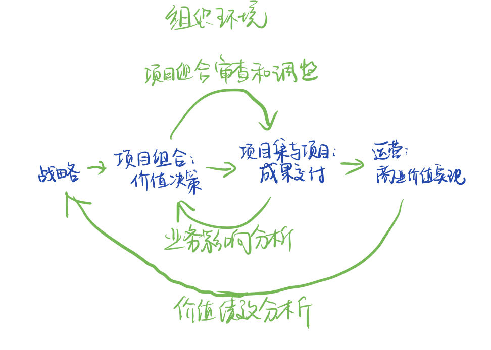
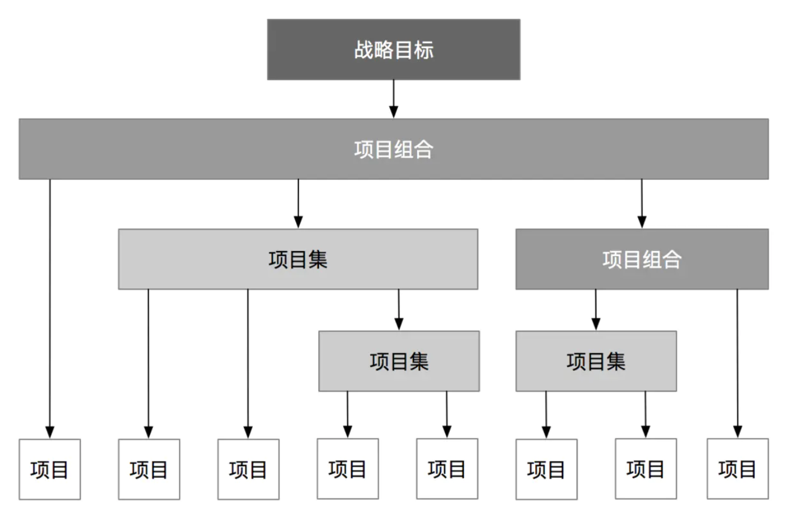

# 个人作业1

## 题目描述

简答题：

* 讨论projects、programs、和protfolio之间的关系以及对企业成功的贡献；以及与operations以及OPM之间的关系
  * 请先阅读《PMBok6》中文版，第一部分的1.2.3节；第二部分1.2节
  * 必须描述projects、programs、protfolio、operations和OPM的概念
  * 必须用图或表格表达他它们之间的关系与区别，使得读者更容易理解；
  * 必须列举合适案例用以区别这些概念

* 用“gartner 2020十大战略技术”关键词检索，了解新技术对未来的影响

## 作业内容

### 概念解释

* **Projects**

  **项目的定义（PMBoK）**  

  项目（project）是为创造**独特的产品、服务或成果**而进行的临时性工作。

  * 项目是临时的，它有一个定义好的开始和结束时间，并定义了范围和资源。
  * 项目是独特（一次性）的，它不是一个常规的操作，是为实现一个特定目标而设计的一组特定的操作。因此，项目团队通常还包括来自不同的组织和跨地区的成员。
  * 软件开发、建筑物或桥梁的建造、自然灾害后的救援工作、将销售扩展到新的地区市场等等，都是项目。

   

  **项目的定义（其他）** 

  * 国际项目管理协会（IPMA）：  项目是一个特殊的、将被完成的有限任务，它是在一定时间内，满足一系列特定目标的多项相关工作的总称。
  * 英国项目管理协会（APM）：  项目是由一系列具有开始和结束日期、相互协调和控制的活动组成的，通过实施而达到满足时间、费用和资源等约束条件的独特的过程。
  * 中国项目管理研究委员会（PMRC）： 项目是一个特殊的将被完成的任务，它是在一定时间内，满足一系列特定目标的多项相关工作的总称。
  * 德国DIN（德国工业标准） 69901认为，项目是指在总体上符合下列条件的唯一性任务：      ①具有预定的目标； ②具有时间、财务、人力和其他限制条件； ③具有专门的组织。

   

  **项目的基本特征**

  * 项目有一个独特的目标（a unique purpose）
  * 项目是临时性的（temporary）
  * 项目需要随着发展而逐步细化（profressive elaboration）
  * 项目通常需要来自不同领域的资源（resources）
  * 项目应该有一位主要客户或发起人（customer or sponsor）
  * 项目充满不确定性（involves uncertainty）

   

​	

* **Programs**

  **项目集定义 (PMBOK6)：**

  * 项目集是一组相互关联且被协调管理的项目、子项目集和项目集活动，以便获得分别管理所无法获得的效益。

  项目集管理：

  * 项目集管理是对一个项目集采取集中式的协调管理，以实现这个项目集的战略收益和目标。项目集经历并不对项目进行管理，而是对项目之间的工作进行协调。

  项目集特征：

  * 涵盖多个项目
  * 项目集中的项目是关联的，进度是协同的

  具体到科研创新管理，我们经常会把复杂的产品开发划分为相对独立的单元，每个单元有相应团队负责，而每个相对独立单元的研制就是可以作为一个项目，而这些项目的汇总就是项目集。

   

* **Protfolio**

  **项目组合定义(PMBOK6)：**

  * 项目组合是为实现战略目标而组合在一起管理的项目、项目集、子项目组合和运营工作的集合。

  项目组合管理：

  * 项目组合管理是为了实现特定的战略业务目标，对一个或多个组合进行的集中管理，包括对项目、项目集和其他相关工作的识别、优先排序、授权、管理和控制等活动。

   

* **Operations**

  * 运维，本质上是对网络、服务器、服务的生命周期各个阶段的运营与维护，在成本、稳定性、效率上达成一致可接受的状态。

   

* **OPM**

  * IT运维管理，是指单位 IT 部门采用相关的方法、手段、技术、制度、流程和文档等，对IT软硬运行环境、IT 业务系统和 IT 运维人员进行的综合管理。

  

### 概念之间的关系

* **项目、项目集、项目组合管理的比较概述（PMBOK6）**

  |      | 项目                                                         | 项目集                                                       | 项目组合                                                     |
  | ---- | ------------------------------------------------------------ | ------------------------------------------------------------ | ------------------------------------------------------------ |
  | 范围 | 项目是为创造独特的产品、服务或成果而进行的临时性工作         | 项目集是一组相关联且被协调管理的项目、子项目集和项目集活动，以便获得分别管理所无法获得的效益 | 项目组合的组织范围随着组织战略目标的变化而变化               |
  | 变更 | 项目经理对变更和实施过程做出预期，实现对变更的管理和控制     | 项目集的管理方法是，随着项目集各组件成果和/或输出的交付，在必要时接受和适应变更，优化效益实现 | 项目组合经理持续监督更广泛内外部环境的变更                   |
  | 规划 | 在整个项目生命周期中，项目经理渐进明细高层级信息，将其转化为详细的计划 | 项目集的管理利用高层级计划，跟踪项目集组件的依赖关系和进展。项目集计划也用于在组件层级指导规划 | 项目组合经理建立并维护与总体项目组合有关的必要过程和沟通     |
  | 管理 | 项目经理为实现项目目标而管理项目团队                         | 项目集由项目经理管理，其通过协调项目集组件的活动，确保项目集效益按预期实现 | 项目组合经理监督战略变更以及总体资源分配、绩效成果和项目组合风险 |
  | 监督 | 项目经理监控项目开展中生产产品、提供服务或成果的工作         | 项目集经历监督项目集组件的进展，确保整体目标、进度计划、预算和项目集效益的实现 | 项目组合经理监督战略变更以及总体资源分配、绩效成果和项目组合风险 |
  | 成功 | 成功通过产品和项目的质量、时间表、预算的依从性以及客户满意度水平进行衡量 | 项目集的成功通过项目集向组织交付预期效益的能力以及项目集交付所述效益的效率和效果进行衡量 | 成功通过项目组合的总体投资效果和实现的效益进行衡量           |

* 项目与运维的区别

  |                      | 项目（Projects）                                 | 运维（Operations） |
  | -------------------- | ------------------------------------------------ | ------------------ |
  | 持续时间（Duration） | 临时性 -- 有明确的开始和结束时间（尽管可能变更） | 持续或可重复的活动 |
  | 目标（Objective）    | 交付服务/产品 比较明确的关闭项目条件          | 支持业务           |
  | 结果（End Result）   | 创建唯一的产品或服务                             | 支持业务           |

* 作为项目组合或项目集的组成部分，项目是实现组织战略和目标的一种手段，常常应用于作为项目投资主要引导因素的战略规划之中。为了使项目符合组织的战略业务目标，对项目组合、项目集和项目进行系统化管理，可以应用组织级项目管理（OPM）。OPM指为实现战略目标而整合项目组合、项目集和项目管理与组织驱动因素的框架。 

  OPM旨在确保组织开展正确的项目并合适地分配关键资源。OPM有助于确保组织的各个层级都了解组织的战略愿景、支持愿景的举措、目标以及可交付成果。 

  * 战略、项目组合、项目集、项目和运营相互作用的组织环境

    

    

    

   

* 项目集和项目组合

  

  

  

### 项目管理的重要性

​	项目管理就是将知识、技能、工具与技术应用于项目活动，以满足项目的要求。项目管理通过合理运用与整合特定项目所需的项目管理过程得以实现。项目管理使组织能够有效且高效地开展项目。 

有效的项目管理能够帮助个人、群里以及公共和私人组织：

* 达成业务目标
* 满足相关方的期望
* 提高可预测性
* 提高成功的概率
* 在适当的时间交付正确的产品
* 解决问题和争议
* 及时应对风险
* 优化组织资源的使用
* 识别、挽救或终止失败项目
* 管理制约因素（例如范围、质量、进度、成本、资源）
* 平衡制约因素对项目的影响（例如范围扩大可能会增加成本或延长进度）
* 以更好的方式管理变更

项目管理不善或缺乏项目管理可能会导致：

* 超过时限
* 成本超支
* 质量低劣
* 返工
* 项目范围扩大失控
* 组织声誉受损
* 相关方不满意
* 正在实施的项目无法达成目标

项目是组织创造价值和效益的主要方式。在当今商业环境下，组织领导者需要应对预算紧缩、时间缩短、资源稀缺以及技术快速变化的情况。商业环境动荡不定，变化越来越快。为了在全球经济中保持竞争力，公司日益广泛利用项目管理，来持续创造商业价值。

### 参考资料

PMBoK6

课程ppt

[博客——什么事项目集和项目组合](https://www.jianshu.com/p/74b06a8318ee)