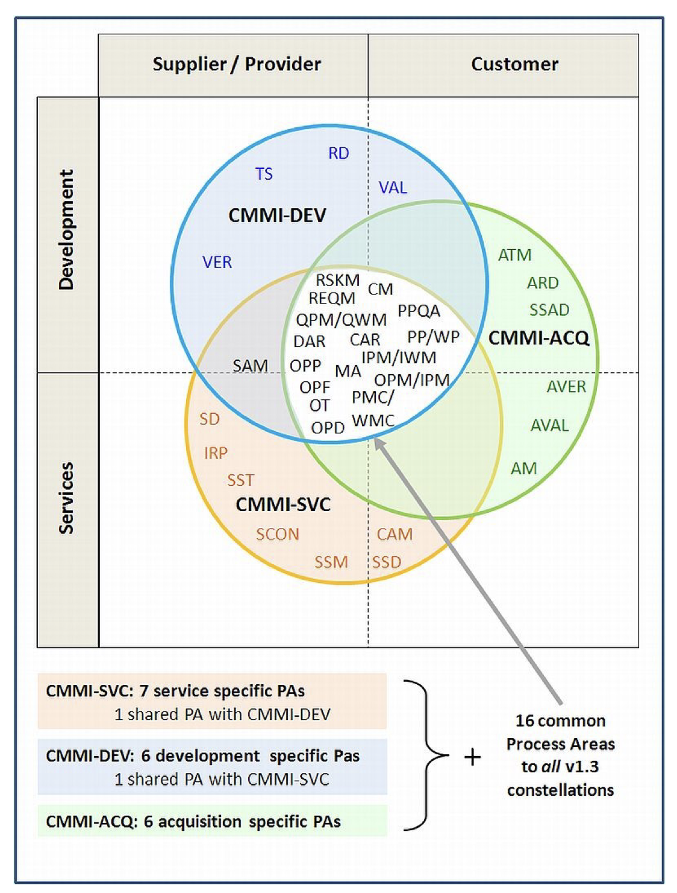
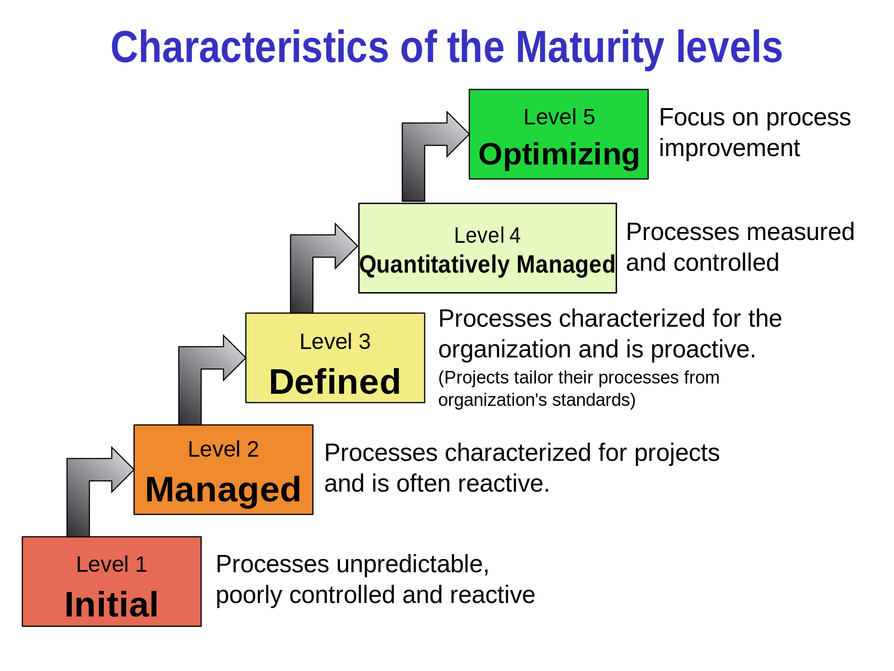
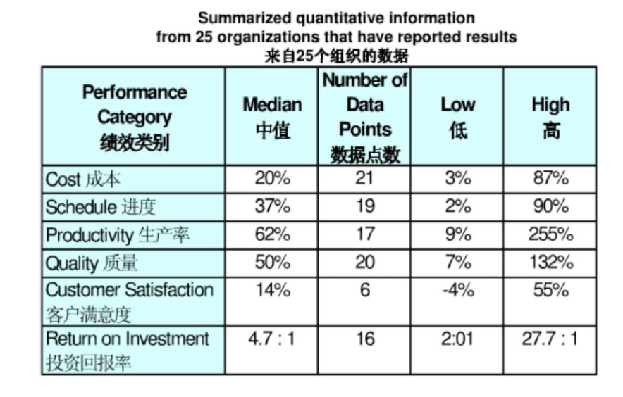
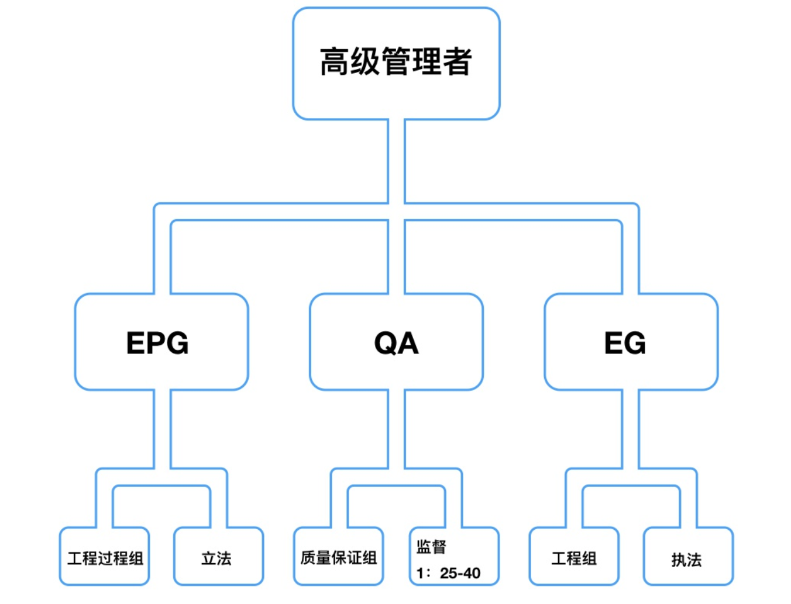
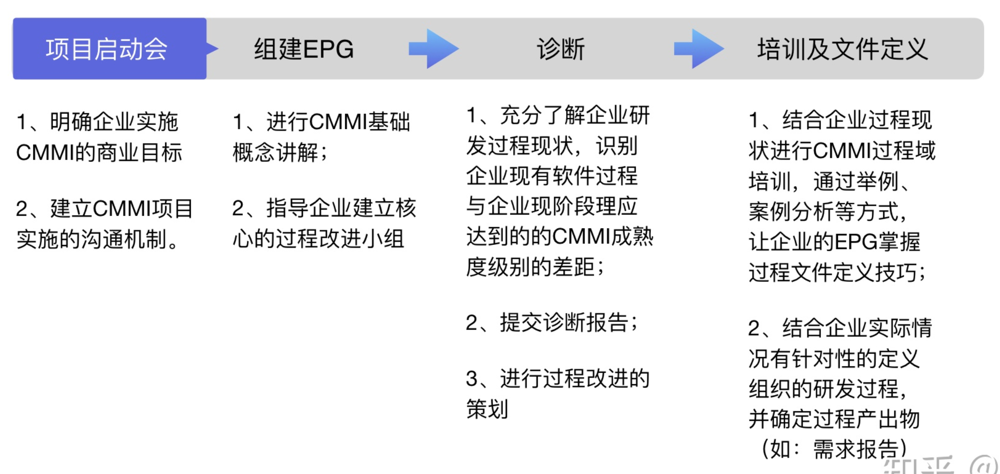
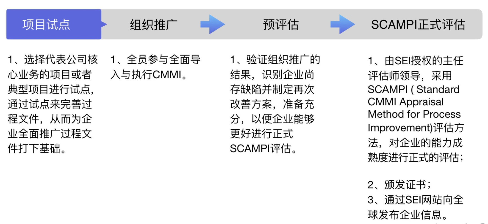

# 个人作业 2

## 题目描述

分析题：

* 请使用系统方法分析问题，大约600-800字（选择一题）
  * 使用业务、组织、技术三维模型系统管理方法分析某校园项目（可自定义）的可行性
  * 有人说企业信息化是“一把手工程”。通过网络搜索IT项目缺乏高级管理层支持失败案例，运用思维导图或系统模型描述高级管理层支持的重要性
  * 选CMMI、ASPICE、ITIL、COBIT5或其他任一IT行业标准，围绕1-2张结构或原理图，解释它运用系统化思维解决行业问题方法

（本次作业我选择第三题中的CMMI）

## 作业内容：CMMI

 

CMMI全称是Capability Maturity Model Integration，即能力成熟度模型集成。

 

CMMI过程框架 

**CMMI模型介绍：三个模型**

* CMMI-SVC

  CMMI-SVC帮助服务性组织去建立质量服务过程架构，使其能够更好的改进服务表现和提高企业的服务收益性。

* CMMI-ACQ

  CMMI-ACQ模型帮助组织或企业为他们的客户进行外包、采购、交易或者其他采购产品服务提供了管理架构。

* CMMI-DEV

  CMMI-DEV模型帮助生产服务开发组织整合他们的软件开发和系统工程来改进他们本身的性能和提高过程改进的效率。

 

**三个模型的适用范围**

* CMMI-SVC
  * 针对IT服务、运维服务企业
  * 指导组织改进服务流程，提高服务质量和客户满意度
* CMMI-ACQ
  * 针对采购方：比如国内的金融、电信企业，需要常年大量采购的企业
  * 供应商选取、供应合同拟定、供应商能力管理等
* CMMI-DEV
  * 针对供应方：软件开发企业、外包、集成或硬件企业
  * 用于指导开发过程

 

**CMMI能力分级认证体系**

 

 

### CMMI如何运用系统化思维解决行业问题方法

**商业目标**

 提供高质量的产品和服务、为股东创造价值、提高客户满意度、增加市场份额、吸引和留住人才。 

**运用CMMI的意义**

* 质量和进度：能保证软件开发的质量于进度，能对“杂乱无章、无序管理”的项目开发过程进行规范
* 成本控制：因为质量有所保证，浪费在修改、解决客户的抱怨方面的成本会降低很多
* 参与人员：每一个具体参与其中的员工，无论是项目经理还是工程师，甚至一些高层管理人的做事方法逐渐变得标准化、规范化
* 绩效管理水平：公司通过过程改进，建立了财富库以共享经验，而不是单纯依靠某些人员。通过度量和分析开发过程和产品，简历公司的效率指标

 

**实施CMMI的投资回报**

 

根据SEI统计，用于软件项目上的CMMI投资，其回报率在：5:1到8:1之间。 

来自SEI的投资回报数据： 

 

**实施CMMI的组织机构** 

 

 

**影响范围** 

 

* 业务人员：可以以某一个业务单位（比如政务或者烟草可以单独过）过CMMI5，也可以以公司范围过（必须覆盖所有的业务项目）
* 人员：参与项目人数至少覆盖业务范围总人数的一半以上；QA：25-40人配一名专职的QA
* 组织机构：设立EPG，至少包括一名公司高层管理者，一名专职EPG组长，EPG组兼职人员需要至少一名需求、设计、测试、配置、项目管理等方面的专家

 

**CMMI模型的两种表示法**

 

在CMMI中，每一种CMMI学科模型都有两种表示法：阶段式表示法和连续式表示法。 

不同表示法的模型具有不同的结构。**连续式**表示法强调的是单个过程域的能力，从过程域的角度考察基线和度量结果的改善，覆盖面窄，其关键术语是“能力”；而**阶段式**表示法强调的是组织的成熟度，从过程域集合的角度考察整个组织的过程成熟度阶段，覆盖面宽，其关键术语是“成熟度”。

 

**CMMI两种不同的实施方法**

 

 

**CMMI实施步骤**

 

 

**实施难点**

 

* 培养持续改进的文化
* 提供强势的领导
* 从价值认可岛资源陪到及考核体系
* 量化改进效果，与商业策略和业绩联系起来
* 改进的可持续性（技能水平，尤其是工程领域的改进）

 

CMMI是一个庞大的过程元模型，自发布以来在世界软件界产生了巨大的影响。CMMI等级评估已经成为业界公认的标准，CMMI的证书成了一个企业或组织能力和形象的标志，没有这个证书不仅难以获得国外项目，甚至也难以在国内一些项目的竞标中获胜。CMMI适合企业操作，避免了某些管理体系只重理论而忽视实践的缺陷。在我国，随着媒体的宣传和政府的支持，许多企业引入了CMMI咨询和认证，对于整个软件行业的管理提升及研发效率提高起到了很大的帮助作用。但也有一些企业引入CMMI体系后，只留下一些形式上的开发流程和文档模板，在管理上并无实质性改进。对于CMMI，业界一直存在着两种声音，有人认为CMMI执行过度，得不偿失；也有人说它过于通用，实用价值不大；但多数人还是认同它，并根据需要加以应用。

**参考资料**

[维基百科](https://en.wikipedia.org/wiki/Capability_Maturity_Model_Integration)

 

[CMMI体系介绍](https://zhuanlan.zhihu.com/p/114862647)

