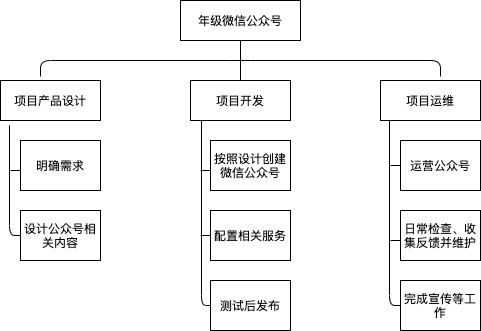
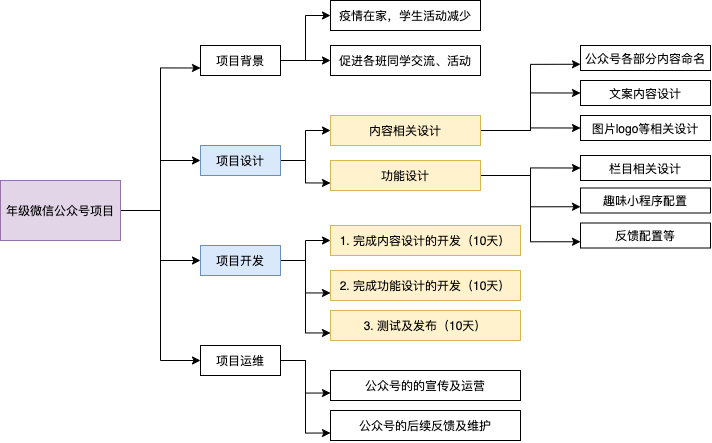

# 个人作业4

## 题目描述

1. 你联合同学做一个年级微信公众号加强各班相互了解、联合活动等。请编制项目章程和项目管理计划，指导该项目实施与运营。必须包含 WBS 和 甘特图。
2. 召开一个项目策划研讨会，每个人用思维导图记录会议内容，该图必须满足“话题跟踪、热点标注、要点排序、问题汇总”四个基本要求。最后，给出这样会议记录的优点与缺点。

## 作业内容1：项目章程和项目管理计划

### 1. 1项目章程：

* 项目综述：

  * 项目名称：年级微信公众号

  * 背景：疫情期间同学们都在家隔离，各类线下校园活动等也无法正常举办。

  * 目的：为了加强各班同学们相互了解、联合活动等，拟创立年级微信公众号。

  * 项目主要干系人：

    * 项目发起人：李四
    * 项目经理：张三
    * 项目团队：产品团队（Team A）；设计团队（Team B）；技术团队（Team C）；测试团队（Team D）；运维团队（Team E）

  * 项目初步计划（总里程碑进度计划）：

    | 工作内容                 | 计划开始时间 | 计划完成时间 | 补充说明 |
    | ------------------------ | ------------ | ------------ | -------- |
    | 完成公众号的整体设计     | 2020-06-01   | 2020-06-10   |          |
    | 项目开发相关             | 2020-06-11   | 2020-06-20   |          |
    | 对公众号的运营进行测试   | 2020-06-20   | 2020-06-30   |          |
    | 正式上线，并做好后续运维 | 2020-07-01   | -            |          |

    * 关键日程里程碑：
      * 2020-06-30前完成微信公众号项目的开发。

  * 项目预算：

    | 项目                       | 预算/元 |
    | -------------------------- | ------- |
    | 硬件相关：开发人员个人电脑 | 0       |
    | 人力资源（10人小团队）     | 200*10  |
    | 总计                       | 2000    |

  * 风险评估：

    * 内容不过审导致的推迟上线；
    * 可能由于运营不佳导致用户体验不好；
    * 可能由于内容缺少趣味性或竞争力等，导致用户过少。

  

### 1.2 项目管理计划

* 工作分解结构：

* 计划概要：

  | 内容                   | 2020.06.01 - 06.10 | 2020.06.11 - 06.20 | 2020.06.21 - 06.30 | 2020.07.01 -   |
  | ---------------------- | ------------------ | ------------------ | ------------------ | -------------- |
  | 完成公众号的整体设计   | **##########**     |                    |                    |                |
  | 将产品的设计输出       |                    | **##########**     |                    |                |
  | 对公众号的运营进行测试 |                    |                    | **##########**     |                |
  | 正式上线及后续运维     |                    |                    |                    | **##########** |

  

## 作业内容2:策划研讨会

* 会议讨论项目：年级微信公众号

* 项目内容：为了加强各班同学们相互了解、联合活动等，拟创立年级微信公众号。

* 会议思维导图：

  

* 思维导图优缺点：

  * 优点：
    * 思维导图与大脑发散性思维关系紧密，可以通过思维导图的帮助，更好地在会议后回忆会议有关内容；
    * 同时会议期间使用思维导图，也可以帮助梳理会议内容，更好的记忆有关内容；
    * 思维导图的延展性很好，可以不断发散、延展，适合会议过程中边听边记；
    * 思维导图也可以帮助更好的理解会议中的要点和关键。
  * 缺点：
    * 由于思维导图过于发散，不适合用来记录比较复杂的逻辑或结构；
    * 在思维导图的引导下，不利于发散思维，思维方式过于单一；
    * 思维导图不像Word、Markdown等记录方式，不方便传播并进行更改，也没有较为严谨统一的模版格式，比较适合个人理解和梳理思维。

  可以看到，思维导图尽管有不少优点，但也不是万能的，应该学习多种技能并结合使用，才能达到更好的效果。