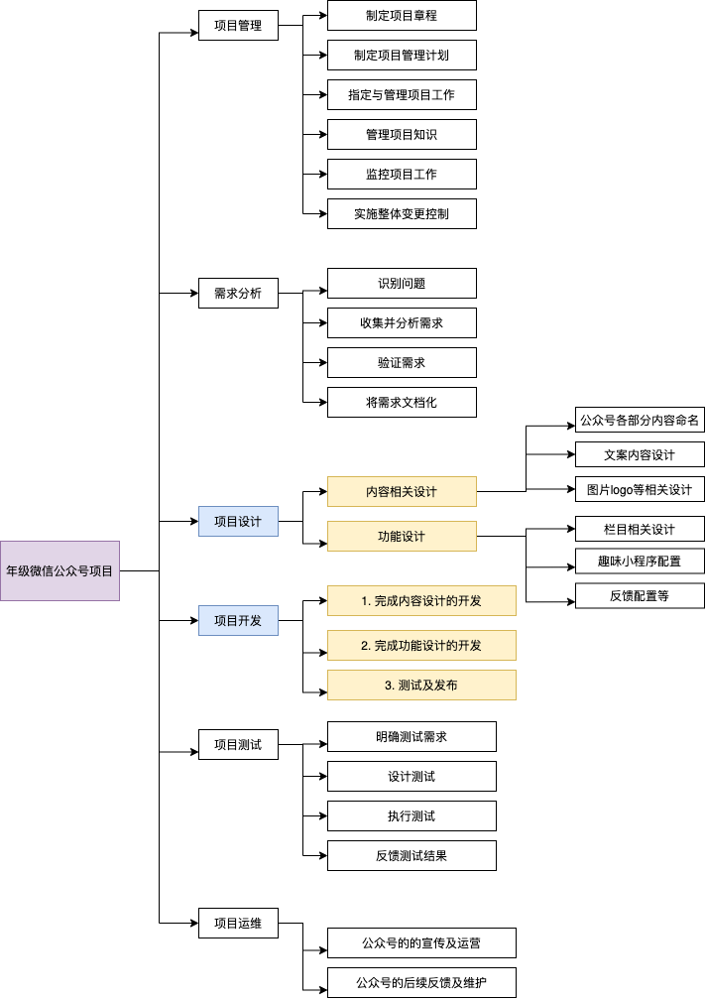
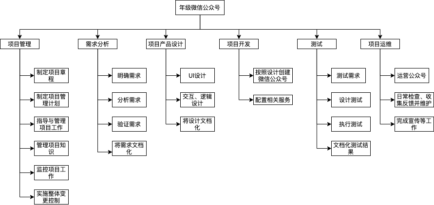

# 作业五

* 你联合同学做一个年级微信公众号加强各班相互了解、联合活动等。请写一份两页的报告，描述收集需求的方法，并附上收集的需求跟踪矩阵（不少于五个需求）；
* 使用思维导图，为作业1或2构建WBS，并使用项目管理工具制作WBS或根特图。并按要求检查工作包的可管理性，分解完整性。例如：检查测试、培训等。

## 微信公众号报告

### 收集需求的方法

* 头脑风暴

  项目小组成员进行群体讨论，开放性的收集项目或产品需求。

  

* 问卷调查

  根据产品和用户特点等信息，设计一套针对性较强的调查问卷。调查问卷的题型最好是设计成选择题的形式，尽可能不要出现问答题的题型，因为同学会嫌填写这种题型麻烦，很可能放弃不填写。另外，还要注意调查问卷题量不要太大，最好是控制在10项左右，题量太大用户就没有耐心填写下去，很可能出现乱填的现象，导致识别的需求不准确。

  

* 焦点小组：研讨会、通过学生会、团委等收集需求

  各班邀请一些同学代表进行开会讨论，了解具体的需求情况。

  

  年级的学生组织承担着相应的职责，也因此掌握了更多的资源，平台更大，就有机会获取更多的信息。可以直接通过学生组织索要相关资料，从而获取需求信息。

  

* 访谈：与同学进行沟通收集需求

  收集需求最为直接的方法就是与客户面对面沟通交流，在与客户沟通前，最好是能先设计好沟通话术，这些话术内容要紧密结合我们需要了解的信息，从而在沟通交流中去识别客户的需求。另外，在人员的选择上最好是选择一些有亲和力、沟通能力强的人员执行该项任务。

  

* 标杆对照：从已有的年级其他类型公众号中收集需求

  已有的其他公众号已经运营了一段时间，具有稳定的受众群体，也有相关的信息，因此可以通过已有的公众号的使用情况获取到需求情况。

  

* 名义小组

  名义小组技术（Nominal Group Technique，NGT），又称名义群体法、名目团体技术、名义群体技术等，是管理决策中的一种定性分析方法。决策过程中对群体成员的讨论或人际沟通加以限制，但群体成员是独立思考的。

  

* 思维导图

  思维导图，英文是The Mind Map，又叫心智导图，是表达发散性思维的有效图形思维工具 ，它简单却又很有效，是一种实用性的思维工具。

  思维导图运用图文并重的技巧，把各级主题的关系用相互隶属与相关的层级图表现出来，把主题关键词与图像、颜色等建立记忆链接。思维导图充分运用左右脑的机能，利用记忆、阅读、思维的规律，协助人们在科学与艺术、逻辑与想象之间平衡发展，从而开启人类大脑的无限潜能。思维导图因此具有人类思维的强大功能。

  

* 亲和图

  KJ法是全面质量管理的新七种工具之一。将处于混乱状态中的语言文字资料，利用其内在相互关系 (亲和性) 加以归纳整理，然后找出解决问题新途径的方法。在讨论问题时，充分吸取参加者的经验、知识和想法等，并用文字或语言加以归类整理，以便采取协同行动求得问题的解决。其主体方法是A型图解 (也称亲和图)。所谓A型图解，是就未知或未经检验过的 (包括未来) 领域中的混乱问题，搜集其事实、意见及设想等方面的语言文字资料，然后利用资料间的相互亲和性作成归类合并图，进而从中找到所要解决的问题和解决问题的办法。

  

* 投票法

  开发团队进行投票，按多数人意愿决定项目范围或产品需求。

  

* 打分法

  开发团队按照某种计分模型设定权重对需求进行打分筛选。

### 收集的需求跟踪矩阵

项目名称：年级微信公众号项目

项目描述：一个为加强各班相互了解、联合活动等的年级微信公众号。

| 标识        | 关联标识 | 需求描述 | 业务需要、机会、目的和目标                                   | 项目目标                     | WBS可交付成果 | 产品设计               | 产品开发 | 测试案例                                 |
| ----------- | -------- | -------- | ------------------------------------------------------------ | ---------------------------- | ------------- | ---------------------- | -------- | ---------------------------------------- |
| 001用户管理 | 1.0      | 用户注册 | 用户注册，并绑定相关信息如姓名学号班级信息等                 | 实现用户注册功能             | 用户注册界面  | 设计相关界面的UI及交互 | 开发     | 不同身份用户、非本专业本年级用户注册测试 |
|             | 1.1      | 用户登录 | 用户通过绑定的微信号或账号密码登录                           | 实现用户登录功能             | 用户登录界面  | 设计相关界面的UI及交互 | 开发     | 不同身份                                 |
| 002班级管理 | 2.0      | 班级注册 | 班级负责人注册对应班级并负责本班人员管理                     | 实现班级注册功能             | 班级注册界面  | 设计相关界面的UI及交互 | 开发     | 不同班级及非本专业班级注册测试           |
|             | 2.1      | 班级沟通 | 班级的沟通界面，班级内部人员可以在这里进行沟通交流；班级间沟通界面，班级间可以进行沟通 | 实现班级内和班级间的沟通功能 | 班级沟通界面  | 设计相关界面的UI及交互 | 开发     | 用户在沟通界面互动测试                   |
|             | 2.2      | 班级活动 | 班级之间的活动界面，各班之间在这里开展联合活动               | 实现开展班级间联合活动功能   | 班级活动界面  | 设计相关界面的UI及交互 | 开发     | 开展和进行班级活动测试                   |
| 003年级管理 | 3.0      | 年级注册 | 年级负责人注册对应年级并进行用户、通知活动等的管理           | 实现年级注册功能             | 年级注册界面  | 设计相关界面的UI及交互 | 开发     | 不同年级及非本专业年级注册测试           |
|             | 3.1      | 年级通知 | 管理员年级通知界面可以发布通知，其他用户在这个界面查看通知   | 实现年级通知功能             | 年级通知界面  | 设计相关界面的UI及交互 | 开发     | 年级通知界面测试                         |
|             | 3.2      | 年级活动 | 管理员开展年级活动，并在年级活动界面展示                     | 实现开展年级活动功能         | 年级活动界面  | 设计相关界面的UI及交互 | 开发     | 开展和进行年级活动测试                   |

## 思维导图

## WBS

