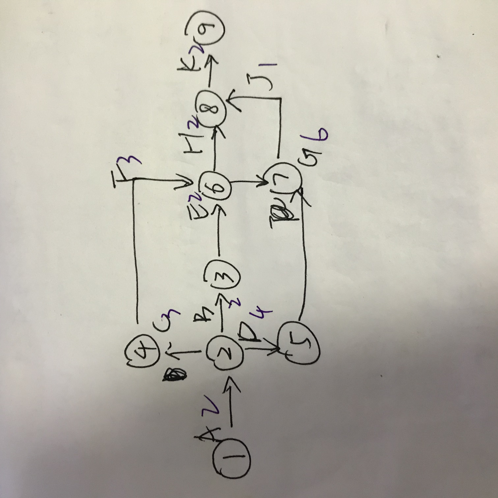
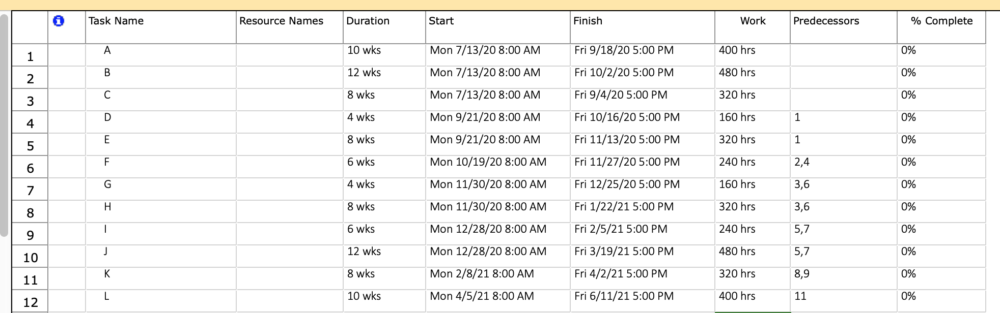
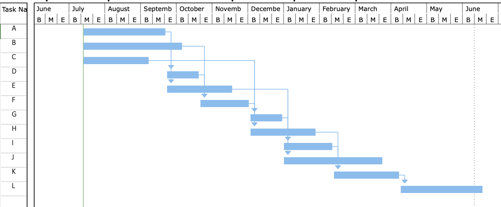
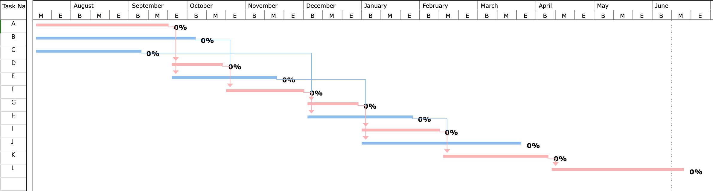
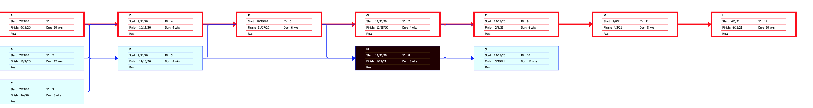
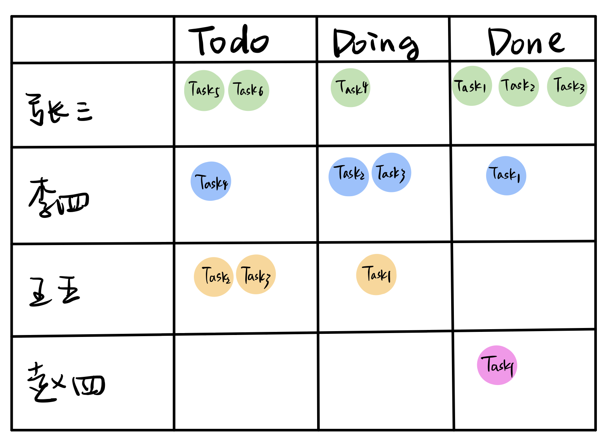
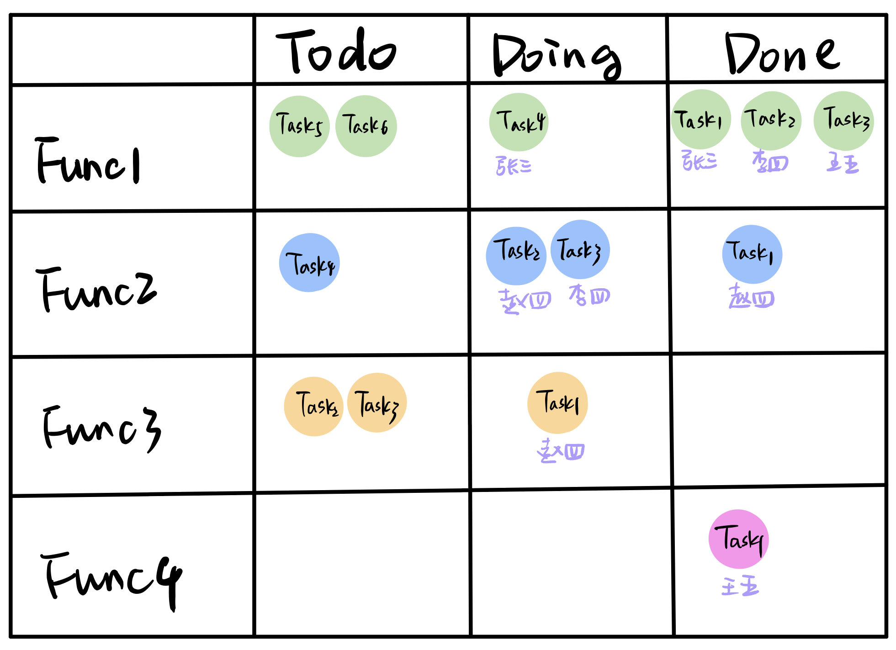

# 个人作业6

练习题：

1. 教材练习题6
2. 教材练习题7
3. 收集网上资料，总结看板在软件项目中的使用（约2-3页）

## 教材练习题6

a. 双代号网络图

b. 所有路径与长度

* 路径1:ADGJK 15
* 路径2:ABEIJK 14
* 路径3:ABEHK 10
* 路径4:ACFIJK 16
* 路径5:ACFHK 12

c. 关键路径与其长度

​	路径4为关键路径：ACFIJK 16

d. 可能的项目最短完成时间

​	路径4ACFIJK 16天

## 教材练习题7

在Mac上用project plan365完成

1. 任务进度表

(任务进度表按照第四题给的数据建立，后续的图通过任务进度表的输入直接生成)

* Task Name 任务名称

* Duration 任务持续时长

* Start 任务开始时间

* Finish 任务结束时间

* Work 工作时长（按每天八小时，一周五天计算）

* Predecessors 前驱任务（这里填的是任务对应的行数）

* % Complete 完成度

  

2. 甘特图

Gantt chart：

Tracking Gantt：

**甘特图**（Gantt Chart）是[条状图](https://zh.wikipedia.org/wiki/条状图)的一种流行类型，显示专案、进度以及其他与时间相关的系统进展的内在关系随着时间进展的情况，是由[亨利·甘特](https://zh.wikipedia.org/wiki/亨利·甘特) (Henry Laurence Gantt) 于1910年开发出。在专案管理中，甘特图显示[专案](https://zh.wikipedia.org/wiki/專案)的[终端元素](https://zh.wikipedia.org/wiki/终端元素)的开始和结束，概要元素或终端元素的依赖关系，管理者可透过甘特图，监控专案当前各任务的进度。若想要同时显示多个不同的专案开始与结束的时间，就可以利用甘特图呈现，监控专案当前各任务的进度。

（以上来自维基百科[甘特图]([https://zh.wikipedia.org/zh/%E7%94%98%E7%89%B9%E5%9B%BE](https://zh.wikipedia.org/zh/甘特图))）

甘特图纵轴对应任务，横轴对应时间，条的长度表示任务的持续时间，任务间的箭头连接的两任务，前者是后者的前驱任务。追踪甘特图中旁边的百分比表示该任务的完成度。

3. 网络图

网络图展示了项目活动及其逻辑关系，每个框对应任务，箭头连接的两个任务，前者是后者的前驱任务。

## 看板在软件项目中的使用

### 看板介绍

[看板管理]([https://zh.wikipedia.org/wiki/%E7%9C%8B%E6%9D%BF%E7%AE%A1%E7%90%86](https://zh.wikipedia.org/wiki/看板管理))常作“Kanban管理”（来自日语“看板／カンバン *Kanban*”），是[丰田生产模式](https://zh.wikipedia.org/wiki/丰田生产模式)中的重要概念，指为了达到[及时生产](https://zh.wikipedia.org/wiki/及时生产)（JIT）方式控制现场生产流程的工具。及时生产方式中的[拉式](https://zh.wikipedia.org/w/index.php?title=推拉策略&action=edit&redlink=1)生产系统可以使信息的流程缩短，并配合定量、固定装货容器等方式，而使生产过程中的[物料](https://zh.wikipedia.org/wiki/物料)流动顺畅。

（以上来自维基百科[看板管理]([https://zh.wikipedia.org/wiki/%E7%9C%8B%E6%9D%BF%E7%AE%A1%E7%90%86](https://zh.wikipedia.org/wiki/看板管理))）

####  看板在项目流程中载体的分类

* 实体白板/黑板

  这是敏捷开发团队中用的最多，最直接的一种看板类型，且适合团队所有成员都在一个办公室工作的环境。

  它的优点一目了然，方便工作成员展示自己的任务和进度，另一方面则可以提高成员间互相竞争的意识（谁干的多，谁解决的问题越难，成就感就越强）。当然，缺点也很明显，就是没有历史记录。虽然可以使用不定期的拍照来解决，但是还是不方便追溯。

  白板适用在项目管理中所包含的元素有：

  - 白板
  - 列表(纵向列表、横向泳道)
  - 便签纸
  - 图钉、磁铁

* 互联网式的看板

  国内外的项目管理工具非常多，但是能实现敏捷开发的工具却不多，而能像看板一样展示的工具更不多。以下介绍几款看板工具：

  * `Trello`：有网页端也有移动端, https://trello.com/
  * `WeKan`：参考`Trello`实现的开源版。与`Trello`最大的区别在于每个任务没有Deadline，且没有移动端。 https://wekan.io/
  * `leangoo`： https://www.leangoo.com/ 

在软件类的项目管理工具中，最大的优点就是有历史记录的追溯，方便查询快照，而且对于一个成员在异地工作的团体来说，互联网式的看板工具是一种最好的选择。

#### 项目管理在看板中的职责分类

* 项目管理主导型

  项目管理是整个团队的大总管，他非常清楚团队中各个成员的优缺点，所以他能够知道什么任务派给谁是最适合的。

  如下图所示，项目管理把任务分配给张三、李四、王五、赵四，成员只要完成自己的任务就好：

  

  

  

* 成员主导型

  成员主导型里，项目管理依然要把项目拆分成各个小任务，然后，然后就让大家自己去“抢”任务了。“抢”任务，为什么要抢？前提是成员自己认为能够胜任这个任务，二是要建立在多劳多得或者是绩效考核之上的，如果没有这些，就没有“抢”的意义了。

  如下图所示，是成员主导型的看板展示：

#### 根据团队的规模增减看板

* 如果是基本的项目管理，就可以和上面所展示的一样，列表项目为Todo、Doing、Done三列；
* 如果是技术部的项目管理，需要管理的人员有程序员、测试、运维，那么列表项目可以是：Todo、Dev-Doing、Dev-Done、Testing、Deploy五列；
* 如果你是一个产品制作人/产品经理，你的团队成员包含了一个产品创建所需要的所有人员，那你可能需要2个看板，一个是需求池看板，一个是迭代流程的看板。

参考博客：[说说看板在项目中的应用](https://www.jianshu.com/p/24e8229adc62)