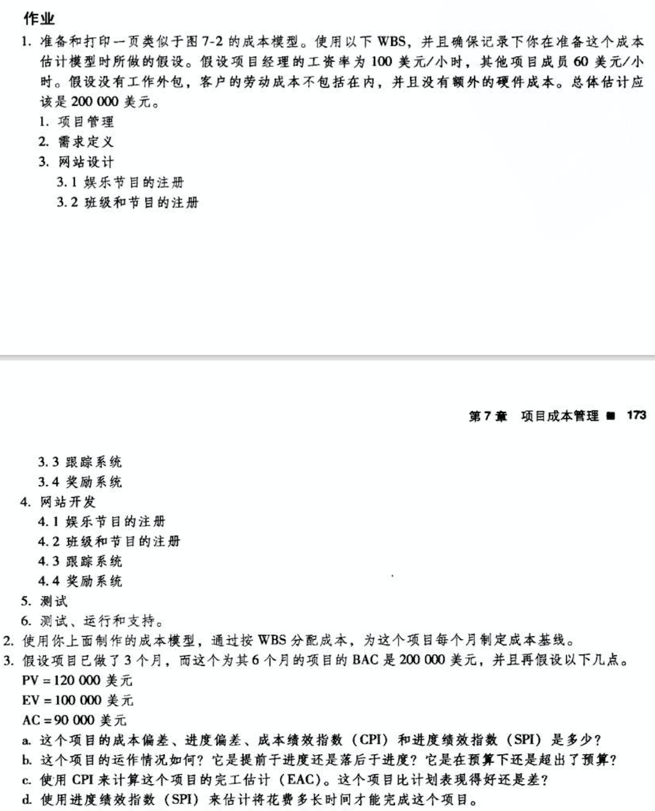

# 个人作业7

## 1. 作业题1

| WBS条目              | 数量或小时数 | 单位小时成本（美元） | 子层总和（美元） | WBS第2层总和（美元） | 占总和的% |
| -------------------- | ------------ | -------------------- | ---------------- | -------------------- | --------- |
| 1. 项目管理          |              |                      |                  | 35,200               | 34        |
| 1.1 项目经理         | 160          | 100                  | 16,000           |                      |           |
| 1.2 项目团队成员     | 320          | 60                   | 19,200           |                      |           |
| 2. 需求定义          | 80           | 100                  |                  | 8,000                | 8         |
| 3. 网站设计          |              |                      |                  | 16,000               | 16        |
| 3.1 娱乐节目的注册   | 40           | 100                  | 4,000            |                      |           |
| 3.2 班级和节目的注册 | 40           | 100                  | 4,000            |                      |           |
| 3.3 跟踪系统         | 40           | 100                  | 4,000            |                      |           |
| 3.4 奖励系统         | 40           | 100                  | 4,000            |                      |           |
| 4.  网站开发         |              |                      |                  | 28,800               | 28        |
| 4.1 娱乐节目的注册   | 120          | 60                   | 7,200            |                      |           |
| 4.2 班级和节目的注册 | 120          | 60                   | 7,200            |                      |           |
| 4.3 跟踪系统         | 120          | 60                   | 7,200            |                      |           |
| 4.4 奖励系统         | 120          | 60                   | 7,200            |                      |           |
| 5. 测试              | 120          | 60                   |                  | 7,200                | 7         |
| 6. 测试、运行和支持  | 120          | 60                   |                  | 7,200                | 7         |
| 总额                 |              |                      |                  | 102,400              |           |

## 2. 作业题2

| WBS条目              | W1   | W2   | W3   | W4   | W5   | W6   | W7   | W8   | Total |
| -------------------- | ---- | ---- | ---- | ---- | ---- | ---- | ---- | ---- | ----- |
| 1. 项目管理          |      |      |      |      |      |      |      |      |       |
| 1.1 项目经理         | 2000 | 2000 | 2000 | 2000 | 2000 | 2000 | 2000 | 2000 | 16000 |
| 1.2 项目团队成员     | 2400 | 2400 | 2400 | 2400 | 2400 | 2400 | 2400 | 2400 | 19200 |
| 2. 需求定义          | 4000 | 4000 |      |      |      |      |      |      | 8000  |
| 3. 网站设计          |      |      |      |      |      |      |      |      |       |
| 3.1 娱乐节目的注册   |      |      | 4000 |      |      |      |      |      | 4000  |
| 3.2 班级和节目的注册 |      |      | 4000 |      |      |      |      |      | 4000  |
| 3.3 跟踪系统         |      |      | 4000 |      |      |      |      |      | 4000  |
| 3.4 奖励系统         |      |      | 4000 |      |      |      |      |      | 4000  |
| 4.  网站开发         |      |      |      |      |      |      |      |      |       |
| 4.1 娱乐节目的注册   |      |      |      | 2400 | 2400 | 2400 |      |      | 7200  |
| 4.2 班级和节目的注册 |      |      |      | 2400 | 2400 | 2400 |      |      | 7200  |
| 4.3 跟踪系统         |      |      |      | 2400 | 2400 | 2400 |      |      | 7200  |
| 4.4 奖励系统         |      |      |      | 2400 | 2400 | 2400 |      |      | 7200  |
| 5. 测试              |      |      |      |      |      | 2400 | 2400 | 2400 | 7200  |
| 6. 测试、运行和支持  |      |      |      |      |      | 2400 | 2400 | 2400 | 7200  |

## 3. 作业题3

a. 

CV（成本偏差） = EV（挣值） - AC（实际成本） = 10000 美元

SV（进度偏差） = EV - PV（计划值） = -20000 美元

CPI（成本绩效指标） = EV / AC = 1.11

SPI（进度绩效指标） = EV / PV = 0.83

b. 

由a.可得：

CV > 0，实际消耗的费用低于预算，效率高，有结余；

SV < 0，进度滞后；

CPI > 1，实际成本低于预算；

SPI < 1，进度滞后；

结论：进度落后于计划，花费在预算内。

c. 

EAC（完工估计） = BAC / CPI = 180000 美元

完工估算值低于完工预算，该项目比计划表现得好。

d. 

t = (6 - 3) / 0.83 = 3.6 月

剩余工期 = (6 - 3) / 0.83 = 3.6 月

