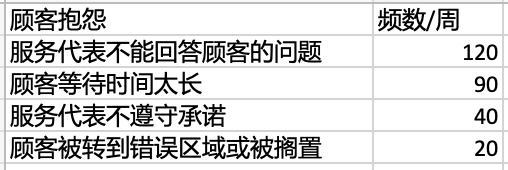
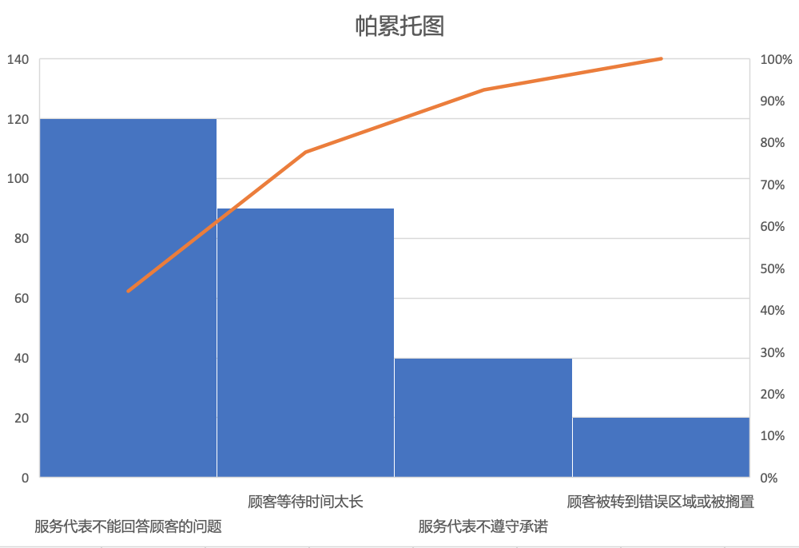
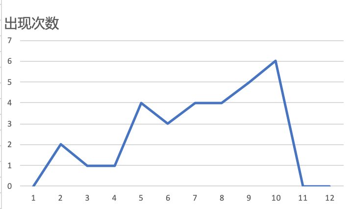

# 个人作业 8

教材练习题1-3:

## 练习题 1

项目管理教师聘用质量标准：

学历要求：博士及以上

专业要求：管理学或计算机相关专业

经历要求：有一定教学经历，或在管理学或计算机相关行业就业经历

## 练习题 2

## 练习题 3

写一个程序完成30次骰子的实验，实验结果如下：

画图如下：

并不能完全反应正态分布，原因可能是由于试验次数不够多。

不过也可以看到，2和12出现的次数很少。

